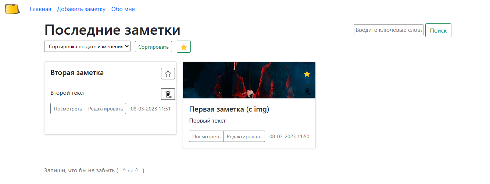

# Веб приложение заметки "Незабудка"
написано на языке **Java**

**Возможности:**

✔ Вывод всех заметок на главный экран

✔ Создание, редактирование, удаление простейших заметок только с текстом. 

✔ Сохранение заметки между сеансами приложения, при помощи PostgreSQL.

✔ При первом запуске, приложение имеет одну заметку с текстом.

✔ Есть возможность помечать важные заметки.

✔ К заметкам можно добавлять картинки

❏ Выбор нужной сортировки на главном экране

❏ Корзина хранит удаленные заметки

**<details><summary>Скриншоты приложения</summary>**

Окно создания заметки 
<p align="center" >    </p>

Можно делать заметки с картинками(первая заметка) и только с текстом. 
<p align="center" >    </p>

По щелчку на "Посмотреть" можно открыть окно просмотра любой заметки из главной страницы. 
<p align="center" >    </p>

Окно редактирования можно открыть из окна просмотра или из главной страницы.  
<p align="center" >    </p>

Заметку можно пометить как важную на главной странице или в окне редактирования
<p align="center" >    </p>

</details>

**<details><summary>Для старта приложения надо внести корректировки в application.properties</summary>**

```java
# SQL
spring.datasource.url=jdbc:postgresql://localhost/forgetMeNot #если хочется можно поменять название БД
spring.datasource.username=#Ввести свой логин от postgresql
spring.datasource.password=#Ввести свой пароль от postgresq
```

```java
# storing a profile photo
upload.path=# задать свою деректорию для сохранения изображений. Например: /C:/photo
spring.servlet.multipart.max-file-size=5000KB 
spring.servlet.multipart.max-request-size=5000KB
```
</details>

**Стек технологий**

IntelliJ IDEA,Maven, Spring, PostgreSql, Bootstrap, Thymeleaf.


