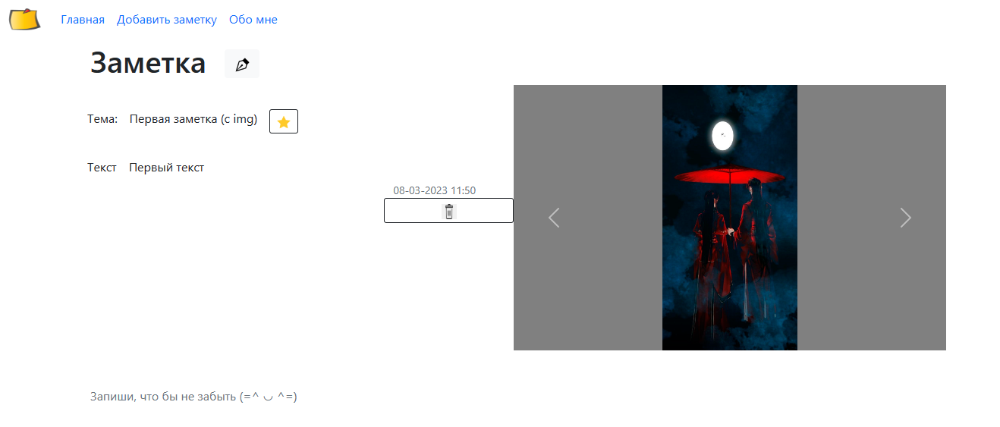
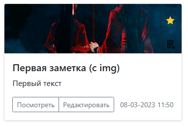

# Web-приложение заметки "Незабудка"
написано на языке **Java**

**Возможности:**

✔ Создание, редактирование, удаление заметок.

✔ Вывод всех существующих заметок на главный экран.

✔ Сохранение заметки между сеансами приложения, при помощи PostgreSQL.

✔ При первом запуске, приложение имеет одну заметку с текстом.

✔ Есть возможность помечать важные заметки.

✔ К заметкам можно добавлять картинки

✔ Выбор нужной сортировки на главном экране

Стартовая страница: http://localhost:8080/notes

**<details><summary>Для старта приложения надо внести корректировки </summary>**

В **Postgresql** надо создать базу **forgetMeNot** 

В **application.properties** ввести данные для подключения **Postgresql** и указать в какой папке будут храниться изображения

```java
# SQL
spring.datasource.url=jdbc:postgresql://localhost/forgetMeNot
spring.datasource.username=#Ввести свой логин от postgresql
spring.datasource.password=#Ввести свой пароль от postgresq
```

```java
# storing a profile photo
upload.path=# задать свою деректорию для сохранения изображений. Например: /C:/photo
# file size limit (can be deleted)
spring.servlet.multipart.max-file-size=5000KB 
spring.servlet.multipart.max-request-size=5000KB
```
</details>


**<details><summary>Скриншоты приложения</summary>**

Окно создания заметки 
<p align="center" >    </p>

Можно делать заметки с картинками(первая заметка) и только с текстом. На главной странице есть возможность сортировать заметки.
<p align="center" >    </p>

По щелчку на "Посмотреть" можно открыть окно просмотра любой заметки из главной страницы. 
<p align="center" >    </p>

Окно редактирования можно открыть из окна просмотра или из главной страницы.  
<p align="center" >    </p>

Заметку можно пометить как важную на главной странице или в окне редактирования
<p align="center" >    </p>

</details>

**Стек технологий**

IntelliJ IDEA,Maven, Spring, PostgreSql, Bootstrap, Thymeleaf, Flyway.

**<details><summary>Мои похожие Pet-проекты </summary>**

**Web-приложение «Blog»** - проект для обучающего курса от Naumen (осень 2022)

*Описание:* у каждого пользователя есть своя страница - профиль. Пользователь может постить, редактировать, удалять посты, редактировать свой профиль, искать посты по различным параметрам. При помощи Spring Security реализована регистрация и авторизация пользователя. Есть роль администратора. Он может удалять пользователей и назначать пользователям роли.

*Стек:* Java, Spring, PostgreSQL, Flyway, Thymeleaf, Maven, Jpa

*Ссылка на проект:* https://github.com/Mukusha/Blog

**Приложение «Заметки»** - javaFX приложение

*Описание:* приложение, в котором можно создавать, редактировать, удалять заметки; помечать заметки как важные. Заметки сохраняются между сеансами приложения в БД.

*Стек:* Java, Maven, JDBC, SQLite, Javafx, SceneBuilder, CSS

*Ссылка на проект:* https://github.com/Mukusha/Notes

</details>
